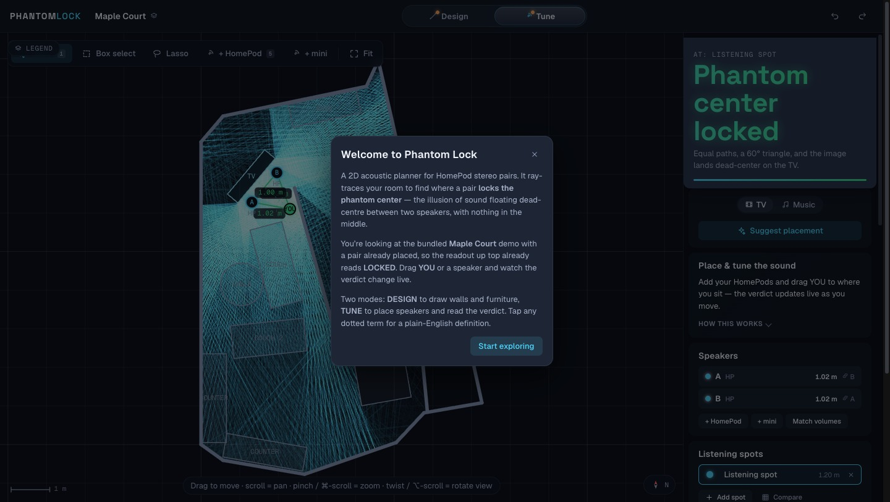
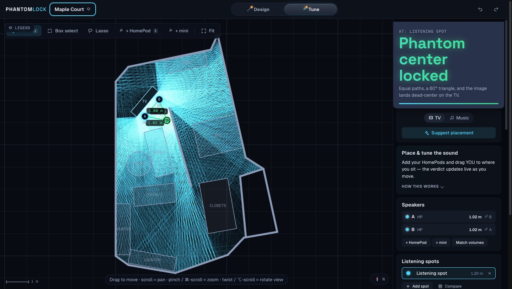
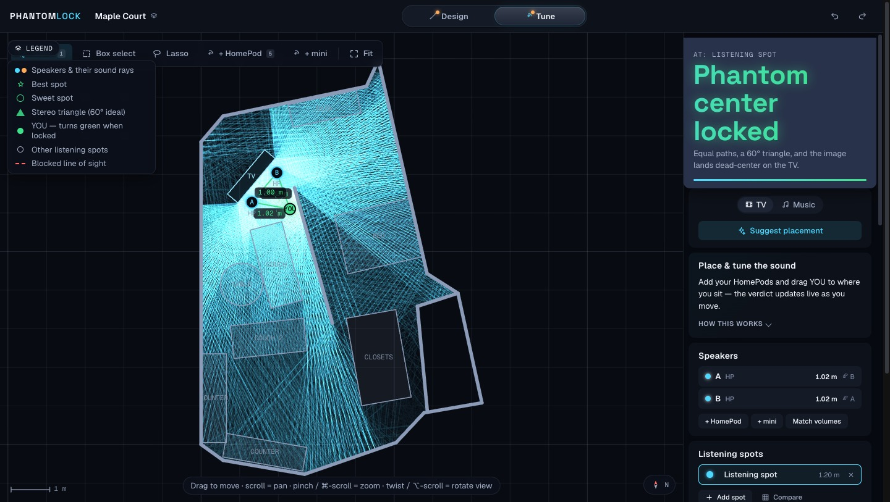
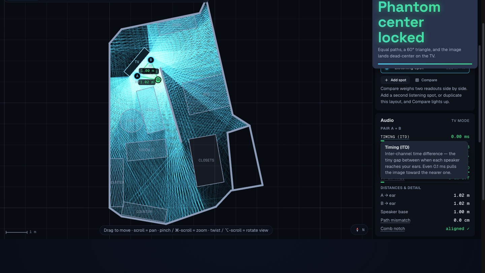
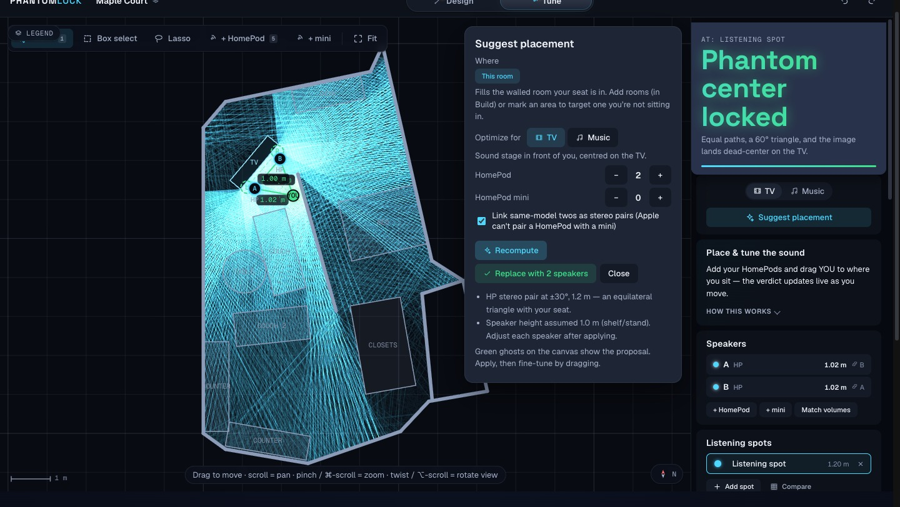
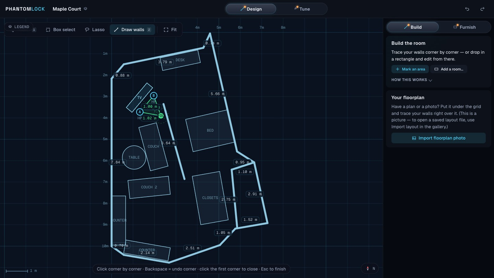
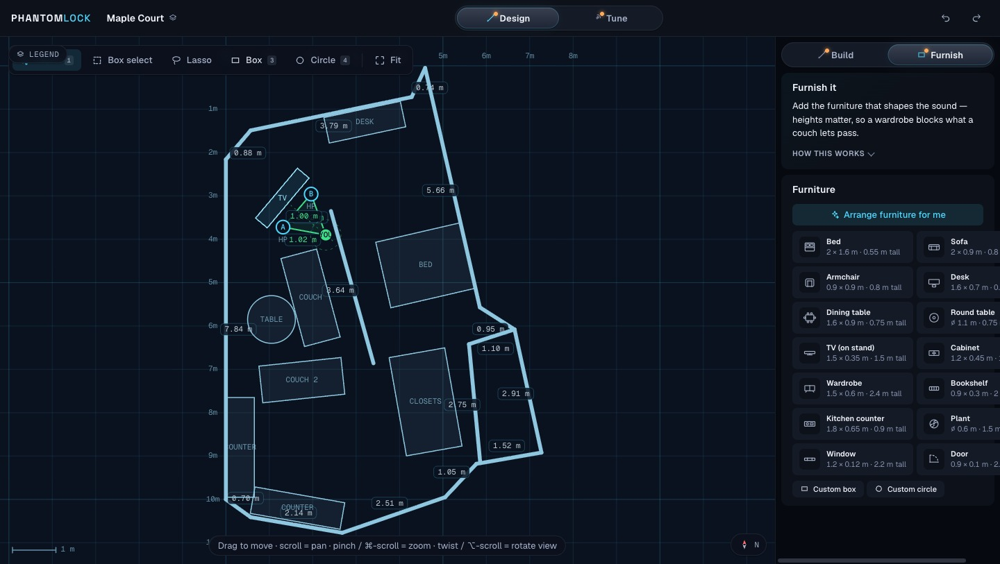
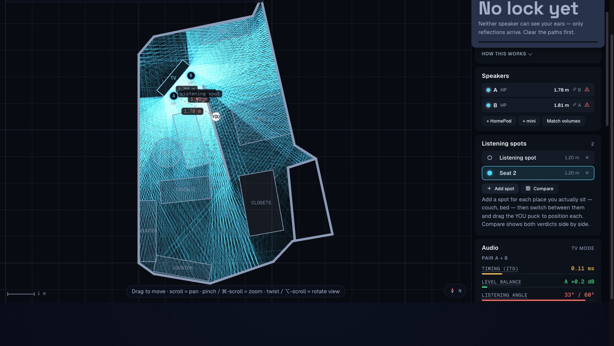
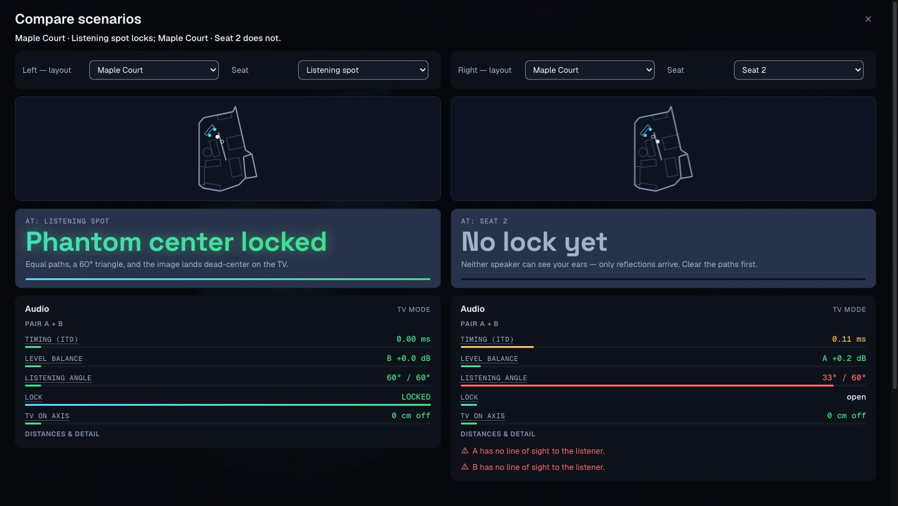

# Phantom Lock — Acoustic Room Planner

**Find the objectively best place to put your speakers — and the best place to sit —
with a real 2.5D acoustic ray-tracing engine that runs entirely in your browser.**

Most "speaker placement" advice is folklore. Phantom Lock instead *simulates* the room:
it casts hundreds of sound rays per speaker, bounces them off walls and furniture at their
real heights, checks true 3D line-of-sight to your ears, and turns the result into one
plain-English verdict — **is the stereo phantom center locked, and if not, why not?**

It ships with a bundled sample apartment so you can start immediately, and you can draw any
number of your own layouts from a floorplan photo or from scratch. No backend, no account,
no network calls: everything runs locally and layouts live in your browser's IndexedDB.

Zero runtime dependencies beyond React. The physics is a hand-written TypeScript engine;
the project carries **644 unit tests**, 169 of them over the engine itself.

---

## The walkthrough

Every screenshot below is the real app, driven end-to-end in headless Chrome against the
production build on a fresh browser profile. Nothing is mocked and no output is fabricated.

### 1. First run — a live verdict before you touch anything



A pristine install seeds the bundled *Maple Court* demo with a stereo pair already placed at
±30°, so the readout is a genuine **LOCKED** result computed by the engine on first paint —
not a canned graphic. The welcome modal explains what "phantom center" means, then gets out
of the way.

### 2. TUNE — the ray field and the readout



Dismissing the modal reveals the core loop. The glowing field is the actual traced rays. The
headline is the payoff: **Phantom center locked**, with the reason underneath — *"Equal
paths, a 60° triangle, and the image lands dead-center on the TV."* Drag **YOU** or a speaker
and it re-derives live.

### 3. What am I looking at?



The on-canvas legend is a collapsible disclosure keyed to the current mode — in TUNE it
decodes the ray colours, the green ★ best seat, the sweet-spot ring and the 60° triangle.

### 4. The numbers behind the verdict



Under the headline is a monospaced spec sheet: inter-channel time difference, level balance,
subtended angle, lock state, TV alignment. Every dotted-underlined term is a real button that
opens a plain-English definition, so "ITD" never goes unexplained.

### 5. Let the optimizer place them



*Suggest placement* searches for a position that actually locks, then shows its reasoning
("HP stereo pair at ±30°, 1.2 m — an equilateral triangle with your seat") and previews the
result as green ghosts on the canvas before you commit. Applying it is undoable.

### 6. DESIGN / Build — draw the room



Switching to DESIGN swaps the canvas to a dark cyanotype plan with live dimension labels.
Trace walls corner-by-corner (snapping to 45° and a 5 cm grid), or drop in a floorplan photo
and trace over it.

### 7. DESIGN / Furnish — fill it in



Place furniture by hand from the palette, or hit *Arrange furniture for me* and let the rule
engine reason about circulation, daylight, quiet, first-reflection absorption and feng shui.

### 8. A second listening spot



Real rooms have more than one seat. Adding one re-runs the whole simulation for it — and here
the second spot does **not** lock, because the speakers can't see it.

### 9. Compare — the decision, in one screen



The question this app exists to answer: *where do the speakers go so both the couch and the
bed sound right?* Compare puts two (layout, seat) scenarios side by side — **Phantom center
locked** (ITD 0.00 ms, 60°/60°) against **No lock yet** (0.11 ms, 33°/60°) — with the actual
cause spelled out: *"A has no line of sight to the listener."*

---

## Run it

```bash
npm install
npm run dev       # Vite dev server → http://localhost:5173
npm test          # 644 unit tests (vitest, two projects)
npm run lint      # ESLint (flat config)
npm run build     # tsc --noEmit + production build
npm run preview   # serve the production build with real security headers
```

No API keys, no backend, no environment setup. Layouts persist locally in IndexedDB; a
one-click *Export all* writes a portable JSON backup of every layout.

Requires Node 20.19+ or 22.12+ (Vite 7's declared range). Developed and verified on macOS with Chrome; the app is a standard
static site with no platform-specific code, but automated browser checks run in Chromium
only.

---

## Architecture

```
src/
├── engine/                 pure TypeScript, no React — unit-tested in Node
│   ├── raytrace.ts         ray casting, 3D line-of-sight, graze attenuation, door gaps
│   ├── stereo.ts           pair metrics (ITD/ILD/angle), phantom-center lock verdict
│   ├── pairspot.ts         per-pair wall-aware sweet-spot search + image-source bounces
│   ├── bestspot.ts         the green-★ "best place to sit" field for all speakers
│   ├── optimize.ts         "Suggest placement" (listener / room / whole-house targets)
│   ├── rooms.ts            flood-fill room regions (walkable vs sound zones)
│   ├── arrange.ts          rule-based furniture arranger
│   ├── detect.ts           floorplan photo → walls (Otsu → Hough → merge)
│   ├── scene.ts            presets, sanitize/migrate, multi-listener model, import limits
│   ├── seed.ts             the first-run demo (a verified-locked pair)
│   ├── db.ts               hand-rolled IndexedDB persistence (images as Blobs)
│   └── geometry · vec · hit · joints · speakers · types
└── components/             React 19 + Vite UI
    ├── app/                shell, mode/IA, keyboard dispatch, extracted hooks
    ├── canvas/             pure canvas renderer, pointer/keyboard interaction, legend
    ├── panels/             sidebar cards, verdict, metrics spec sheet, glossary
    ├── compare/ gallery/   2-up scenario compare, layout gallery
    └── ui/                 Dialog, Menu, Toast, Term, Icon
```

**Data flow:** the canvas and panels produce an immutable `Scene`; `traceScene` casts the
rays; `computeAudio` turns arrivals into pair metrics; `deriveVerdict` reduces those to the
single headline you read. The engine never imports React, so every acoustic claim is
unit-testable in isolation — which is why the physics has real tests and the advice is
trustworthy.

**Information architecture:** two modes. **DESIGN** (dark cyanotype canvas) holds *Build* and
*Furnish*; **TUNE** (dark ray canvas) merges placement and analysis into one loop so the
verdict updates while you position. The mode is the single controller of the canvas theme —
a tool can never change it.

---

## Technical deep-dive

**The hardest decision was the metric space for the stereo lock.** A phantom center is
"locked" when the listener forms an equilateral triangle with the pair (equal distance → zero
ITD, ±30° → correct width) *and*, in cinema mode, the TV sits on that axis. The trap: the
sweet-spot geometry is a **2D floor-plan** construction, but arrival time and level are
genuinely **3D** — speaker height matters. Early versions mixed the two, measuring the
triangle with 3D leg lengths against a 2D base, so a pair mounted symmetrically at head
height could *never* lock even when it was acoustically perfect.

The rejected alternative was to make everything 3D. That fails the other way: a pair at
mismatched heights can have equal *floor* distances and unequal *path* lengths, and a naive
2D-only fix reports it as locked when it audibly is not. The shipped fix needs both halves —
compute the triangle in one consistent 2D plan space, keep 3D strictly for ITD and level, and
add a separate 3D arrival-symmetry gate (`pathDiff ≤ 0.07 m ≈ 0.2 ms`). A false "locked" is
worse than an honest "almost there."

**Reflections were the other subtle one.** The image-source method mirrors a speaker across a
wall and charges the folded path — but a naïve implementation happily "reflects" off the empty
air inside an open doorway. The engine now refuses a bounce whose reflection point lands in an
*open door* leaf, while closed doors and windows stay real reflectors. Both legs of every
bounce are occlusion-checked, and the surfaces of the mirror wall itself are excluded from
that check — otherwise the wall doing the reflecting registers as the thing blocking it. The
alternative, mirroring every furniture rectangle too, was rejected as far too expensive for a
first-order model.

**A non-obvious one you would not guess from the summary:** the listener is stored as a
`listeners[]` array while the legacy single `scene.listener` is kept as a *derived mirror*,
re-synchronised on every write. That kept ~13 engine read-sites and every previously saved
layout working unchanged when multi-seat support landed — but it also created the sharpest
class of bug in the codebase, because a desynchronised mirror shows a verdict for one seat
while the echogram traces another, with nothing on screen to indicate it. The invariant is
now enforced at the boundary: importing a layout whose object id collides with the active
seat's id used to silently re-issue the *seat's* id, dropping YOU onto a different seat
entirely. Seats and speakers now claim their ids before objects, which are the only entities
nothing references by id.

**Accessibility is part of the engineering, not a coat of paint.** The canvas is a genuine
keyboard-operable widget (`role="application"`, published key map, deterministic
selection traversal over every seat, speaker and object) with two off-screen live regions on
deliberately different cadences — selection announces immediately, the readout waits for the
value to settle. Colour contrast is enforced by a test that reads the real stylesheets off
disk, not by a comment.

---

## Security

Zero backend means a small attack surface, but not an empty one: the app accepts untrusted
**layout JSON** and **floorplan images**. See **[docs/security.md](docs/security.md)** for the
full posture. In brief:

- A strict **Content-Security-Policy** (`default-src 'none'`, no `unsafe-inline`, no nonce
  needed) is injected into the production build and shipped as real headers in
  `public/_headers` / `vercel.json`. Verified live against the production build — 18/18
  golden-path steps, 0 violations, with a negative control proving it enforces.
- The layout importer **rejects** hostile files rather than repairing them, and the load path
  never clamps or truncates your own saved data — a limit that silently mangles real work
  would be worse than the problem it solves.
- A 354-byte layout used to permanently brick the app (a non-terminating grid loop that
  OOM-crashed and re-crashed on every reload). That is fixed, and the fix is tested.

One limit is stated honestly rather than papered over: worst-case simulation CPU for a
payload tuned to sit just under every import limit is **mitigated, not closed** — bounding it
properly needs an iteration cap inside the engine's grid loops, which is scheduled work.

---

## Controls

| | |
|---|---|
| `1`–`4` (DESIGN) | select · wall · box · circle |
| `1` / `5` (TUNE) | select · speaker |
| `T` | switch DESIGN ⇄ TUNE (the mode owns the canvas theme) |
| `N` / `Shift+N` † | cycle to the next / previous item on the canvas |
| `P` (TUNE) † | place a speaker beside your listening spot |
| `D` / `W` (DESIGN) † | cut a door / window into the selected wall |
| arrows | nudge selection 5 cm (`Shift` = 25 cm) |
| `Q` / `E` | rotate the selected box 1° (`Shift` = 15°); hold to sweep |
| `R` | rotate the view |
| `Del` | delete selection |
| `⌘Z` / `⇧⌘Z` | undo / redo |
| `Esc` | deselect |
| scroll | pan · `⌘`-scroll or pinch = zoom · `⌥`-scroll = rotate view |
| space-drag / right-drag | pan |

† needs canvas focus, so these never fire while you're working in the sidebar.

Digit shortcuts are scoped to the current mode, so they never select a tool that mode
doesn't have. On touch, the on-selection handles do the same jobs — a tap is one fine step and
press-and-hold sweeps continuously, so furniture can be seated flush against a wall at any angle. Everything autosaves. Export/import layouts as JSON — import always adds, it
never overwrites.

---

## Development

- `npm test` — 644 tests across two vitest projects: **618** pure-logic tests in Node and
  **26** jsdom + axe accessibility tests. The engine is the source of truth; add a failing
  test first for every new acoustic behaviour.
- `npm run lint` — flat ESLint, clean.
- `npm run build` — `tsc --noEmit` + a production Vite build (~404 kB / 130 kB gzipped JS,
  43 kB / 8 kB gzipped CSS; self-hosted fonts are separate static assets).
- The project follows a session-based roadmap (`docs/master-plan.md`) under an
  adversarial-review operating protocol (`CLAUDE.md`); `docs/ultrareview.md` is a full audit
  and `docs/security.md` documents the security posture.

Built with React 19 + Vite + TypeScript. No runtime dependencies beyond React.
